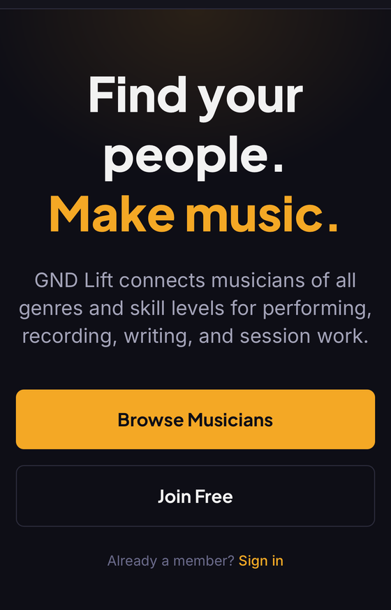
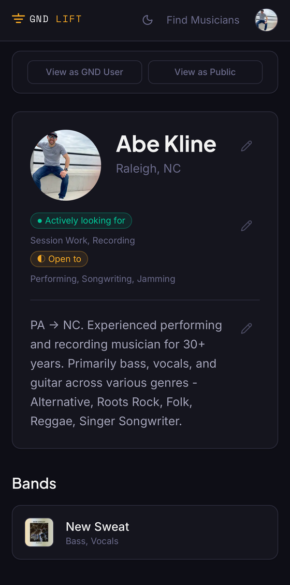
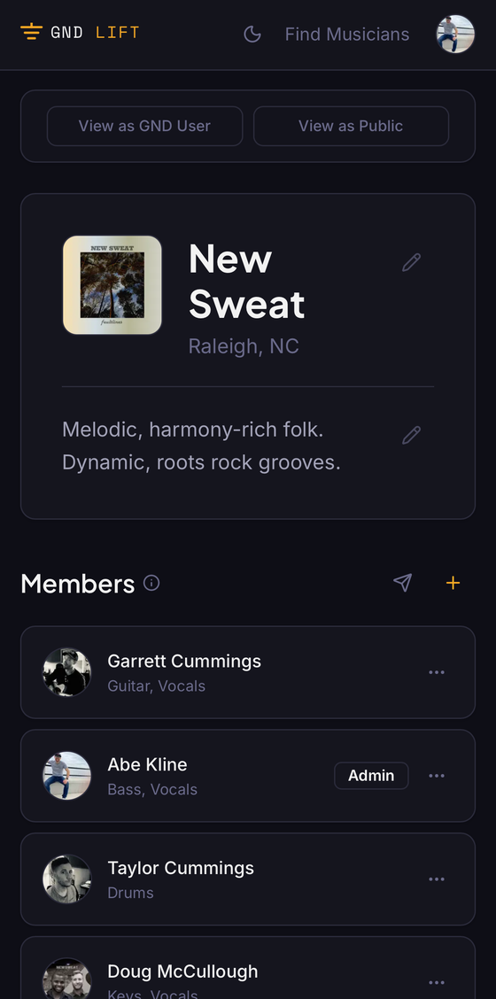
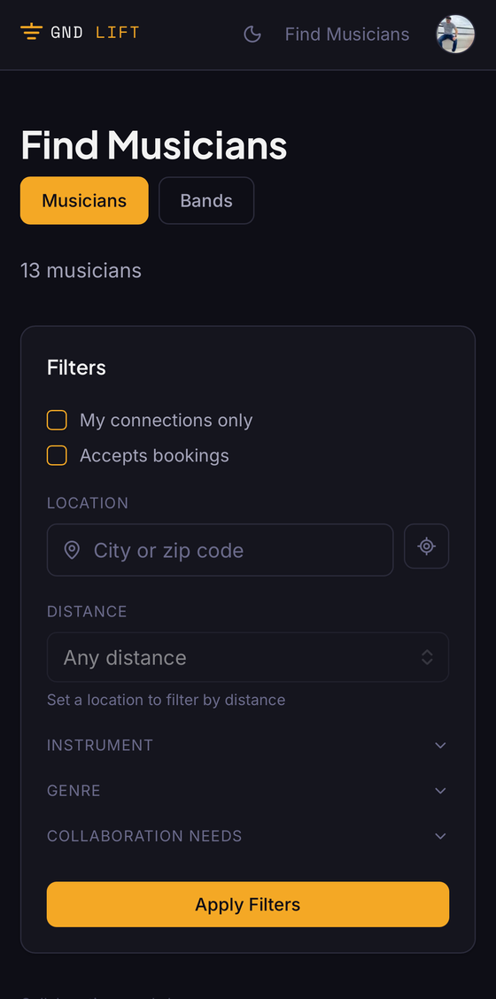

# GND Lift

**Live app:** [gndlift.com](https://gndlift.com/)

GND Lift is a social platform for musicians — a place to build a profile, showcase your bands and discography, and find people to perform, record, write, or do session work with.

*Landing page — the pitch: find your people, make music.*

*Musician profile — bio, availability, and linked bands.*

*Band page — members, roles, and discography, shown here for New Sweat.*

*Find Musicians — filter by instrument, genre, location, and collaboration needs.*

## Features

- **Musician profiles** — instruments with skill level, genres, gear, bio, and external links (streaming platforms, socials)
- **Bands** — dedicated pages with member rosters, roles, and linked discography
- **Discography & credits** — albums and singles with streaming links and per-track collaborator credits
- **Discovery & matching** — search and filter musicians by instrument, genre, location, distance, and collaboration needs
- **Networking** — connect with other musicians, send invites, and track discovery clicks and profile views
- **Booking** — optional "Contact for Booking" on a profile, plus a shareable review link for outside work

## Tech Stack

- **Frontend:** React
- **API / Auth / DB:** Supabase
- **Deployment:** Vercel

## Background

GND Lift grew out of a simple observation from years of playing in bands: finding collaborators — a fill-in drummer, a co-writer, someone for session work — usually comes down to word of mouth or scattered social media posts. GND Lift centralizes that into searchable profiles and bands, using my own musical background (and New Sweat's discography) as the first real content on the platform.
