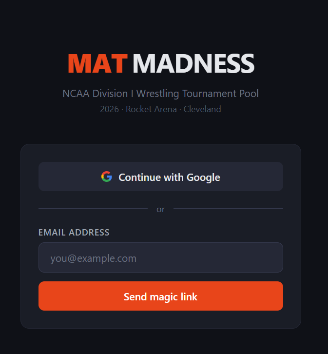
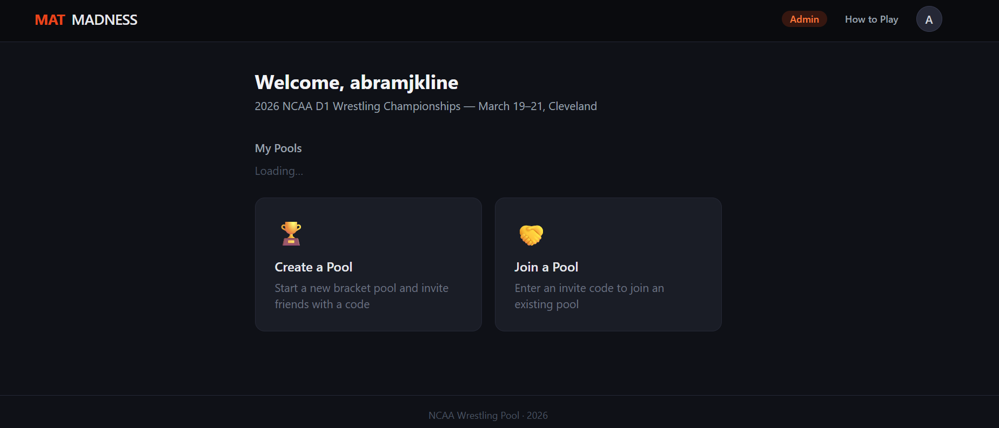

# Mat Madness

**Live app:** [ncaa-matness-app-web.vercel.app](https://ncaa-matness-app-web.vercel.app/)  
**Source:** [github.com/abramjkline/ncaa-matness-app](https://github.com/abramjkline/ncaa-matness-app)

Mat Madness is a web app for running NCAA Division I Wrestling Championship bracket pools with friends — think March Madness bracket challenges, built for the wrestling mat.

It started as a script-heavy Google Sheet and grew into a full web application over time. It's a personal project built for fun, but it's a real app used by real people during tournament season.

*Login screen — Google OAuth and magic link authentication via Supabase.*

*Main dashboard — create a new pool or join an existing one with an invite code.*

## Features

- **Authentication** — Google OAuth and passwordless magic link sign-in
- **Pool management** — Create bracket pools and invite friends with a shareable code, or join an existing pool
- **Admin panel** — Manage pools and tournament data
- **Tournament-aware** — Scoped to a specific NCAA championship year and venue

## Tech Stack

- **Frontend:** React + Vite
- **API / Auth / DB:** Supabase
- **Deployment:** Vercel

## Background

This app began as a simple Google Sheet, morphed into an exceedingly complex script-driven Google Sheet, on to an AppScripts app for viewing results, and finally into this fully functioning React web application. It all started as a challenge to build something that my friends and I could use for fun during the NCAA Wrestling National Championship — akin to the widely-available March Madness bracket apps. The 2026 tournament was the initial release, serving as something of a pilot with our small group. It was a success and, with additional features in the pipeline, it will hopefully be utilized by other groups going forward.
